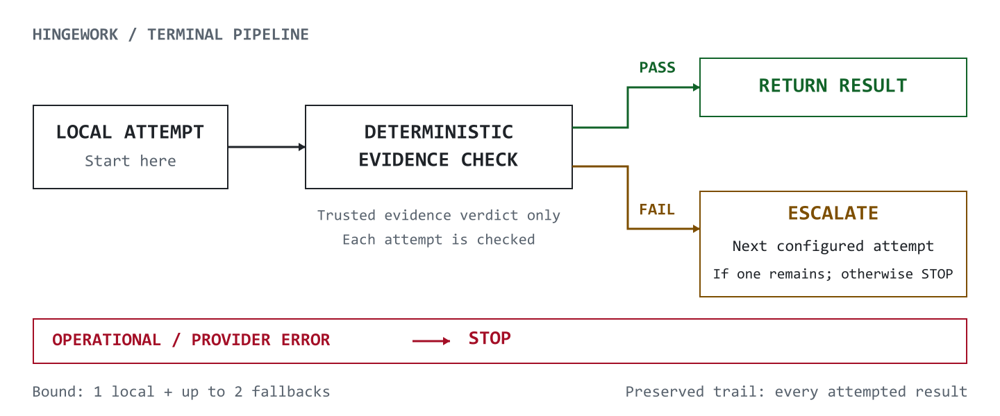

<picture>
  <source media="(prefers-color-scheme: dark)" srcset="assets/brand/hingework-lockup-dark.svg">
  <source media="(prefers-color-scheme: light)" srcset="assets/brand/hingework-lockup-light.svg">
  
</picture>

# Hingework

**Escalate models when evidence checks fail—not when a model feels uncertain.**

Every handoff hinges on hard evidence.

`Python 3.11+` · [`License: MIT`](LICENSE) · `Escalation: ≤3 calls` · `Offline examples`

<picture>
  <source media="(prefers-color-scheme: dark)" srcset="assets/hero/terminal-pipeline-dark.svg">
  <source media="(prefers-color-scheme: light)" srcset="assets/hero/terminal-pipeline-light.svg">
  
</picture>

## In 30 seconds

Hingework is a Python library for model execution, evidence checks, and a recorded trail. Choose sequential local execution, or opt into bounded, local-first escalation.

**A passing local attempt needs no fallback.** If the first attempt passes validation, Hingework stops there.

**Local first. Deterministic validation. Bounded escalation. Preserved trail.**

## Quickstart

Requires Python 3.11 or newer. From this checkout in PowerShell:

```powershell
py -3 -m venv .venv
.\.venv\Scripts\python.exe -m pip install -e .
.\.venv\Scripts\python.exe examples/fake_council.py
.\.venv\Scripts\python.exe examples/escalation_synthetic.py
```

Actual output, in order:

```text
['PASS', 'PASS']
RESOLVED ['EVIDENCE_INVALID', 'VALID']
```

The first example runs two synthetic local adapters sequentially; its `PASS` means a nonempty response without an adapter error, not a citation verdict. The second explicitly opts into escalation: an incorrect citation fails, then an exact citation passes.

Both examples use temporary record directories and remove them afterward. No backend, credentials, provider CLI, model download, or provider configuration is required. Installation may download Python dependencies; the examples make no network requests.

On other platforms, use `python3 -m venv .venv` and `.venv/bin/python` for the remaining commands. The distribution and import namespace are both `hingework`. These commands install the checkout, not a published package.

## Core mechanism

Local/cheap execution is attempted first. Escalation occurs only when deterministic evidence rules require it — not because a model reports low confidence or "thinks" another model should review.

### Two legitimate outcomes

These transcripts are **illustrative control-flow summaries, not literal CLI output**. Hingework does not emit the `[hingework]` lines or ship a top-level CLI.

**Case A — the local/cheap attempt passes**

```text
[hingework] local attempt complete
[hingework] validating evidence...
[hingework] PASS — returning result
[hingework] trail preserved
```

**Case B — evidence failure triggers bounded escalation**

```text
[hingework] local attempt complete
[hingework] validating evidence...
[hingework] evidence check failed
[hingework] escalating to tier 2
[hingework] PASS — returning result
[hingework] trail preserved
```

Case B assumes a configured fallback that passes its own validation. Escalation is conditional; success is not guaranteed.

Here, `PASS` represents a `VALID` evidence verdict and `RESOLVED` run; “tier 2” means the first fallback (the API uses zero-based tier indices).

### Choose the execution path

`run_local_council` runs the caller's local model sequence in order and records each result. It never adds a fallback provider or invokes the escalation validator. `run_escalating_task` is a separate, explicit opt-in API:

```python
from hingework import run_escalating_task

# API sketch: supply a packet, adapters, and an external record directory.
run = run_escalating_task(
    packet,
    local_adapter,
    fallback_adapters,  # zero, one, or two explicit adapters
    record_root,
)
```

See the complete [offline escalation example](examples/escalation_synthetic.py) for a runnable packet and adapters. The first adapter is the caller-designated local/cheap executor. The coordinator makes at most **three adapter calls**: one local call followed, if needed, by at most two ordered fallbacks. It performs no retries, provider discovery, concurrent fallback calls, or evidence expansion.

### Stop and escalation rules

| Coordinator result | Action |
|---|---|
| `VALID` | Stop with `RESOLVED`; identify the successful tier. |
| `EVIDENCE_INVALID` | Record the attempt, then advance if a configured tier remains; otherwise `UNRESOLVED_ALL_FAILED`. |
| `INSUFFICIENT_EVIDENCE` | Advance only when an explicitly supplied deterministic validator computes this verdict; exhaustion yields `UNRESOLVED_SCOPE_EXPANSION_REQUIRED`. Nothing is fetched automatically. |
| Operational/integration failure | Stop with `ERROR`. This includes provider errors, malformed envelopes, validator failures, input mutation, and record-write failures. |

The coordinator invokes the validator itself. Model confidence, requests for review, self-declared statuses, and provider diagnostics cannot authorize escalation. Each attempt gets the same original question, ordered evidence, and task contract, with a fresh invocation identifier. Previous model answers are not forwarded. Recorded verdicts bind the validator rule/version, invocation ID, packet hash, and raw-response hash.

### What the default validator checks

The default evidence check verifies exact citations against supplied sources. It does **not** establish semantic correctness or prove that an answer is true.

`validate_citations` accepts packets with `task_contract="citations_v1"` and a nonempty list of unique `{path, content}` sources. Source paths are opaque labels; no files are opened. Response citations use this exact line format:

```text
- path: source-a | quote: blue
```

At least one citation must match. Every citation must name a supplied source and quote a nonempty substring of its content. Do not add quote wrappers unless they occur in the source. The default rule checks citation mechanics, **not semantic correctness**, and never produces `INSUFFICIENT_EVIDENCE`. A custom pure, deterministic validator can implement a domain's coverage rule; it returns `EvidenceVerdict` and declares a versioned `rule_id`, such as `coverage/v1`.

## Architecture

| Location | Responsibility |
|---|---|
| `src/adapters/` | Explicit provider adapters: `invoke(packet) -> AdapterResult`. |
| `src/evidence/` | Bounded packets and deterministic evidence validation. |
| `src/orchestration/` | Explicit configuration, sequential execution, and opt-in escalation. |
| `src/debate/` | `RecordStore`: exclusive run artifacts, raw adapter text, and hashes. |
| `examples/`, `tests/` | Small synthetic examples and mechanism checks. |

Explicit package mapping preserves the `hingework` namespace. Extensions are ordinary trusted Python code: adapters, deterministic validators, and the sequential adapter factory. The coordinator bounds its own calls; it cannot sandbox extensions or control internal work performed by a provider.

`RecordStore` preserves adapter response text as UTF-8 bytes, not original network bytes. A record-write failure stops the run instead of claiming a preserved trail. Keep runtime records outside tracked source. Path containment checks do not isolate storage from another process concurrently manipulating the filesystem.

No scheduler, service, viewer, full debate state machine, or record-reader CLI is shipped. The reader is intentionally deferred under [D001](docs/DECISIONS.md).

## Configuration

[config/config.example.yaml](config/config.example.yaml) contains only whole-value environment references. [.env.example](.env.example) lists their names with blank values. With no variables set, loading the YAML is valid and leaves all providers unset; mocks work in that state.

```python
from hingework import load_execution_config

config = load_execution_config("config/config.example.yaml")
```

Run this from the checkout after installation. Selecting a real provider requires its explicit endpoint/command and positive timeout. Model selection and record location are explicit invocation inputs.

There is no dotenv auto-loader, global configuration discovery, implicit executable selection, or setup hook. Configuration loading is read-only. Adopt configuration deliberately:

1. Inspect the template and the current configuration you intend to use.
2. Prepare a separate proposed configuration outside the checkout; keep actual values out of version control.
3. Review the diff against the intended target, redacting sensitive values.
4. Explicitly apply the proposal yourself. Importing or installing this package does not apply it.

`load_execution_config(path)` accepts an explicit JSON or YAML path, rejects duplicate/unknown keys, and resolves only named `{env: VARIABLE_NAME}` references. No ambient setting overrides a literal. Missing selected-provider configuration fails before invocation; it does not authorize a fallback.

The Ollama adapter accepts only an explicit loopback HTTP endpoint and disables ambient proxies and redirects. CLI adapters require an explicit executable and timeout; authentication remains owned by the separately configured provider. [provider_request.py](examples/provider_request.py) is an optional single-provider example; unlike the quickstart, explicitly running it requires a configured backend and may send evidence to that provider.

## Testing / verification

```powershell
.\.venv\Scripts\python.exe -m unittest discover -s tests -p test_clean_config.py -v
.\.venv\Scripts\python.exe -m unittest discover -s tests -v
```

Clean-template tests use synthetic providers and block network/provider process calls. The synthetic suite covers evidence changes, confidence invariance, immutable inputs, the three-call cap, malformed responses, repeated invalid evidence, and validator/operational failure stops. The Windows-specific command-line test is skipped elsewhere.

| Provider / path | Recorded verification |
|---|---|
| Synthetic adapters | Offline examples and synthetic/clean-template tests passed. |
| Local Ollama | One live end-to-end smoke passed: external config → adapter → parsed response → validator → clean exit. |
| Codex / Claude CLI adapters | Synthetic protocol/launch checks only; **not live-tested**. |
| Arbitrary external validators / other live integrations | **Not live-tested**. |

See the [technical closeout](docs/EXTRACTION.md) for evidence and limits. The Ollama smoke does not establish live fallback-chain or CLI-provider compatibility.

## Security

Evidence and model output are data, not execution authority. Review [SECURITY.md](SECURITY.md) before using real providers or trusted extension code. Raw records can contain sensitive content; preservation does not silently redact it.

Repository instructions do not override user, organizational, security, or execution policies. Installing the library does not authorize global configuration changes, provider login, model downloads, or calls to unselected providers. Provider CLIs are not universally sandboxed by their adapters.

## Contributing

Keep changes focused on the general-purpose mechanism. Include small synthetic tests for behavior changes, and keep operational records, credentials, private configuration, and real prompts out of patches. Run the relevant tests and update documentation when behavior changes. Preserve evidence-only routing, bounded calls, and explicit configuration adoption.

Read the [architectural decisions](docs/DECISIONS.md) and [brand specification](docs/BRAND.md) before changing those boundaries. For security issues, follow [SECURITY.md](SECURITY.md) rather than publishing sensitive details.

The hub code is offered under the [MIT license](LICENSE). Dependencies, provider programs, and model weights retain their own terms. See [provenance](docs/PROVENANCE.md) for the reviewed lineage and publication conditions.

Prefer a shorter, code-first guide? Read [README_ADHD.md](README_ADHD.md).
